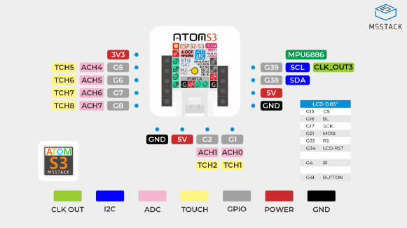
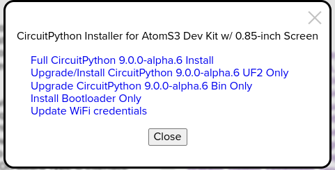
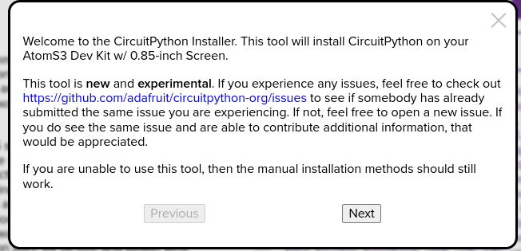
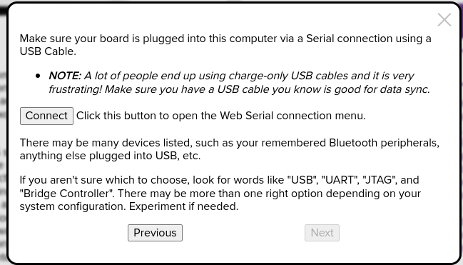
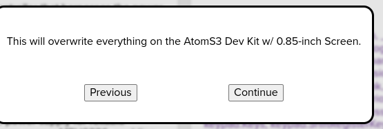
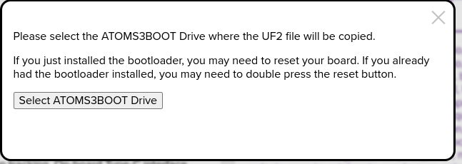
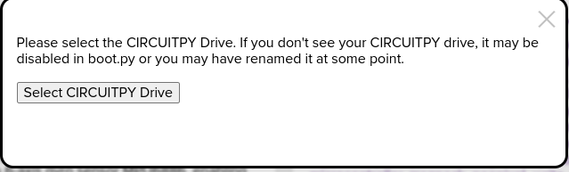
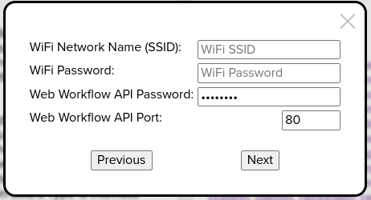
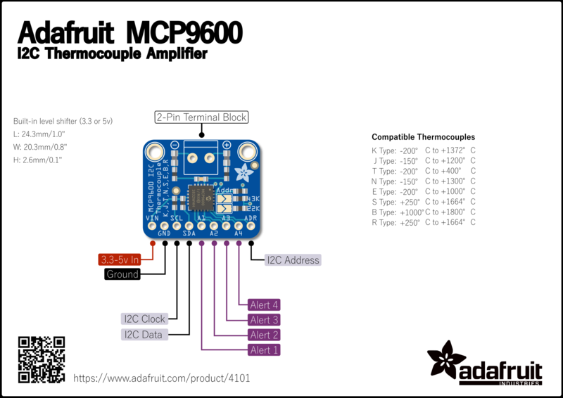

# m5-atoms3-circuitpython-thermocouple

Evaluation of M5 Atom S3 with Circuit Python Reading a Thermocouple over I2C from Adafruit MCP9601

##Project Objectives

- Confirm that I2C can be configured on the Grove port
- Determine how to read an MCP9601 over I2C
- Read calibrated values from a K-type thermocouple
- Display temperature on LCD
- Transmit temperature over Wifi (MQTT or something else)

## Components

- (1) [M5 AtomS3](https://docs.m5stack.com/en/core/AtomS3)
- (1) Adafruit [MCP9601](https://www.adafruit.com/product/5165)
- (1) Adafruit Grove to [STEMMA QT / Qwiic Cable](https://www.adafruit.com/product/4528)
- (1) Adafruit [Type-K Thermocouple](https://www.adafruit.com/product/3245)


## Atom S3

The M5 Atom S3 is based on an Espressif ESP32-S3 microcontroller. Pins G1 and G2 are exposed through the Grove port.





##Install CircuitPython and UF2 Bootloader

CircuitPython has alpha support for the [Atom S3](https://circuitpython.org/board/m5stack_atoms3/)

Follow these steps to install CircuitPython and the UF2 bootloader on a factory fresh Atom S3 using the Google Chrome or Chromium browser

1. Navigate to the Circuit Python [Atom S3](https://circuitpython.org/board/m5stack_atoms3/) page
2. Press and hold the `Reset` button for 2 seconds
3. click `Open Installer`, on the following dialog, choose `Full CircuitPython 9.0.0-alpha.6 install`
   
4. On the following dialog, click `Next`
   
5. On the next dialog, click `Connect`
   
6. Click `Connect` and choose `ttyACM0`
7. Complete the install
   
8. After `combined.bin` has been uploaded, Press `Reset`, then `select ATOMS3Boot Drive`
   
9. Allow Chrome to Edit files in the drive by clicking `Edit files`
   
10. Now select the `CIRCUITPY` drive
    
11. Allow Chrome to Edit files in the drive by clicking `Edit files`
12. Enter Wifi Credentials. Create your own password for `Web Workflow API Password`
    
13. Installation Completed
    


After the installation process, the device will restart and an extremely tiny Python console will appear on the Atom S3 screen. The top line of the display should show the assigned IP address. If it says `no ip` retry the Wifi login process by pressing the `Reset` button again

## Access Circuit Python repl

When an IP address has been acquired by the device it will be accessible over http. Access control is via Basic authentication, use a blank username and the password that was entered during step 12 above.

I found the Web Workflow repl to be rather slow.

The repl can also be accessed through the virtual serial port, in my case on `/dev/ttyACM1`. I can easily access the repl from VSCode using the Serial Monitor extension:

```python
---- Opened the serial port /dev/ttyACM1 ----
---- Sent utf8 encoded message: "\r\n" ----

Adafruit CircuitPython 9.0.0-alpha.6 on 2023-12-12; M5Stack AtomS3 with ESP32S3
>>> 
```

Note that it might be necessary to eject the `CIRCUITPYTHON` removable drive before accessing the repl. To regain access to the `CIRCUITPYTHON` drive, reset the device.

## Investigating I2C and the MCP9601 Amplifier

The Atom S3 Grove port is named "Port A".

Experiment with the repl to determine how to access I2C via Port A on the device.

1. import the `board` module to see which ports are defined
2. There are 3 `PORTA_` attributes, try scanning the I2C bus by manually specifying the SCL and SDA ports:

```python
Adafruit CircuitPython 9.0.0-alpha.6 on 2023-12-12; M5Stack AtomS3 with ESP32S3
>>> 
>>> import board
>>> dir(board)
['__class__', '__name__', '__dict__', 'A1', 'A2', 'A4', 'A5', 'A6', 'A7', 'BTN', 'D1', 
 'D2', 'D38', 'D39', 'D5', 'D6', 'D7', 'D8', 'DISPLAY', 'I2C', 'IMU_SCL', 'IMU_SDA', 
 'IR_LED', 'LCD_BL', 'LCD_CLK', 'LCD_CS', 'LCD_DC', 'LCD_MOSI', 'LCD_RST', 'PORTA_I2C', 
 'PORTA_SCL', 'PORTA_SDA', 'SPI', 'board_id']
>>> board.PORTA_
PORTA_I2C       PORTA_SCL       PORTA_SDA
>>> board.PORTA_I2C
<function>
>>> help(board.PORTA_I2C)
object <function> is of type function
>>> import busio
>>> import adafruit_bus_device.i2c_device
>>> dir(adafruit_bus_device.i2c_device)
['__class__', '__name__', '__dict__', 'I2CDevice']
>>> i2c = busio.I2C(board.PORTA_SCL, board.PORTA_SDA)
>>> dir(i2c)
['__class__', '__enter__', '__exit__', 'deinit', 'readfrom_into', 'scan', 'try_lock', 
 'unlock', 'writeto', 'writeto_then_readfrom']
>>> i2c.scan()
Traceback (most recent call last):
  File "<stdin>", line 1, in <module>
RuntimeError: Function requires lock
>>> i2c.try_lock(); x = i2c.scan(); i2c.unlock()
True
>>> x
[103]
>>> hex(103)
'0x67'
>>> 
```


According to the [Adafruit MCP9601 Documentation](https://learn.adafruit.com/adafruit-mcp9600-i2c-thermocouple-amplifier), the MCP9601 defaults to I2C address 0x67



Further investigation of the `i2c.scan()` function suggests that scan only works once after each hard reset. I was unable to get additional scan attempts to list any devices after `scan()` had been previously executed.

## CircuitPython package manager

The [circup](https://github.com/adafruit/circup) Python package is a simple package manager that can install CircuitPython packages to the  device when the `CIRCUITPYTHON` USB drive is mounted.

Two CircuitPython packages are needed to use the MCP9601

- adafruit_bus_device
- adafruit_mcp9600

```shell
$ cat requirements-circup.txt
adafruit_bus_device
adafruit_mcp9600
$ circup install -r requirements-circup.txt
```

# Basic Sampling Loop

This module reads the thermocouple temperature over I2C and displays it on the screen. It updates once every 5 seconds.


```python
import time
import board
import adafruit_mcp9600

i2c = board.PORTA_I2C()
mcp = adafruit_mcp9600.MCP9600(i2c)

while True:
    print(f"ambient temp {mcp.ambient_temperature:.1f} C, thermocouple temp {mcp.temperature:.1f} C")
    time.sleep(5)
```


