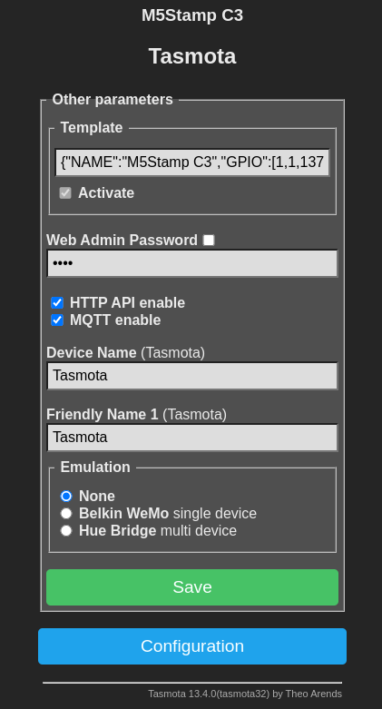
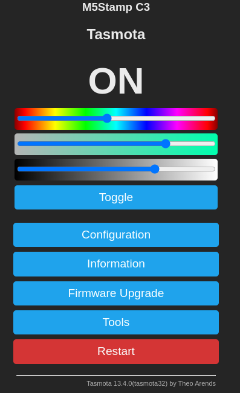

# m5stamp-c3-mate-tasmota

Evaluate the M5Stamp C3 Mate using Tasmota

- [x] Install Tasmota software
- [x] Configure WiFI
- [ ] Capture BLE broadcasts from Temperature Sensors
- [ ] Send data via MQTT


# Components

- [M5Stamp C3 Mate](https://shop.m5stack.com/products/m5stamp-c3-mate-with-pin-headers)
- [Tasmota](https://github.com/arendst/Tasmota)

## M5Stamp C3 Mate

The M5Stamp C3 Mate contains an Espressive ESP32-C3 RISC-V MCU, 4 MB of Flash and 400 KB of internal RAM. Maximum clock speed is 160 Mhz


The device is programmed through the USB port, which emulates a serial device

## Tasmota

The [Tasmota](https://github.com/arendst/Tasmota) software provides a kind of MQTT swiss-army-knife of functionality. The  [documentation](https://tasmota.github.io/docs/) details its functionality, and supported devices.

### Initial Software Installation

1. Connect the M5Stamp C3 to the USB port

2. Download the pre-built `tasmota32c3.factory.bin`  firmware from the [releases](https://ota.tasmota.com/tasmota32/release/) page

3. Erase the flash
   ```shell
   ❯ esptool.py --chip auto --port /dev/ttyACM0 erase_flash                                                                                                                                      
   esptool.py v4.7.0                                                                                                                                                                             
   Serial port /dev/ttyACM0                                                                                                                                                                      
   Connecting....                                                                                                                                                                                
   Detecting chip type... ESP32-C3                                                                                                                                                               
   Chip is ESP32-C3 (QFN32) (revision v0.3)                                                                                                                                                      
   Features: WiFi, BLE, Embedded Flash 4MB (XMC)                                                                                                                                                 
   Crystal is 40MHz                                                                                                                                                                              
   MAC: 34:b4:72:12:85:b8                                                                                                                                                                        
   Uploading stub...                                                                                                                                                                             
   Running stub...                                                                                                                                                                               
   Stub running...                                                                                                                                                                               
   Erasing flash (this may take a while)...                                                       
   Chip erase completed successfully in 17.1s                                                     
   Hard resetting via RTS pin...                                                 
   ```

4. Write the firmware to the device
   ```shell
   ❯ esptool.py --chip auto --port /dev/ttyACM0 write_flash 0x0 /tmp/tasmota32c3.factory.bin       
   esptool.py v4.7.0                                                                              
   Serial port /dev/ttyACM0                                                                       
   Connecting....                                                                                 
   Detecting chip type... ESP32-C3                                                                
   Chip is ESP32-C3 (QFN32) (revision v0.3)                                                       
   Features: WiFi, BLE, Embedded Flash 4MB (XMC)  
   Crystal is 40MHz                                                                                                                                                                              
   MAC: 34:b4:72:12:85:b8                                                                         
   Uploading stub...                                                                              
   Running stub...                                                                                
   Stub running...                                                                                
   Configuring flash size...                                                                      
   Flash will be erased from 0x00000000 to 0x002b8fff...                                                                                                                                         
   Compressed 2852944 bytes to 1636142...
   Wrote 2852944 bytes (1636142 compressed) at 0x00000000 in 145.4 seconds (effective 157.0 kbit/s)...
   Hash of data verified.
   
   Leaving...
   Hard resetting via RTS pin...
   ```

### Initial WiFi Setup

On first boot, Tasmota runs as a WiFi access point:

1. Connect to the access point using a Tablet or other WiFi capable device
2. Enter the SSID and Password for the WiFi network to which the device should connect
3. Optionally enter an admin password

The device reboots and reports it's IP address on the serial port (over USB)
```shell
00:00:00.001-237/10 HDW: ESP32-C3 v0.3 
00:00:00.007-235/09 UFS: FlashFS mounted with 308 kB free
00:00:00.014 CFG: Loaded from File, Count 4
00:00:00.020 QPC: Count 1
00:00:00.055 BRY: Berry initialized, RAM used 4926 bytes
00:00:00.065 Project tasmota - Tasmota Version 13.4.0(tasmota32)-2_0_14(2024-02-14T16:17:50)
00:00:00.319 WIF: WifiManager active for 3 minutes
00:00:00.979 HTP: Web server active on tasmota-1285B8-1464 with IP address 192.168.4.1
00:00:06.918 QPC: Reset
00:01:16.789 WIF: Connecting to AP redacted as tasmota-1285B8-1464 ...
00:01:19.913 WIF: SSId redacted: Connected - IP Address 192.168.---.190
```

### Initial Device Customization

The [Tasmota Device Page](https://templates.blakadder.com/m5stack_m5stamp_c3.html) for the M5Stamp C3 module provides a configuration string that can be pasted into the web based UI. The configuration string sets up the GPIO pin mapping for buttons and the WS2812 RGB LED.

The recommended configuration template:

```json
{"NAME":"M5Stamp C3","GPIO":[1,1,1376,32,1,1,1,1,1,1,1,0,0,0,0,0,0,0,1,1,1,1],"FLAG":0,"BASE":1}
```

Can be pasted into the Template setting on the `Configure Template` menu page:



Once configured (and after rebooting), the web based UI sports a set of slider inputs that can be used to control the RGB LED



