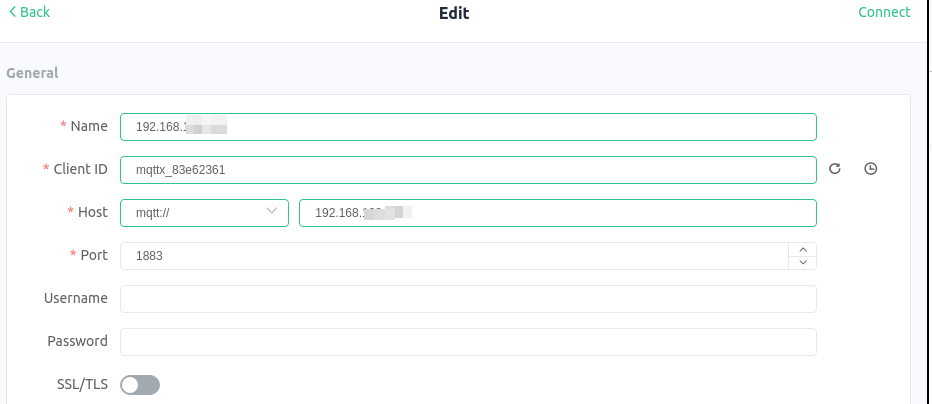
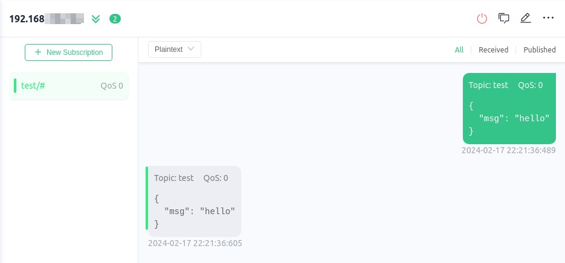

# m5stamp-c3-mate-tasmota

Evaluate the M5Stamp C3 Mate using Tasmota

- [x] Install Tasmota software
- [x] Configure WiFI
- [ ] Capture BLE broadcasts from Temperature Sensors
- [ ] Send data via MQTT


# Components

- [M5Stamp C3 Mate](https://shop.m5stack.com/products/m5stamp-c3-mate-with-pin-headers)
- [Tasmota](https://github.com/arendst/Tasmota)

## M5Stamp C3 Mate

The M5Stamp C3 Mate contains an Espressive ESP32-C3 RISC-V MCU, 4 MB of Flash and 400 KB of internal RAM. Maximum clock speed is 160 Mhz


The device is programmed through the USB port, which emulates a serial device

## Tasmota

The [Tasmota](https://github.com/arendst/Tasmota) software provides a kind of MQTT swiss-army-knife of functionality. The  [documentation](https://tasmota.github.io/docs/) details its functionality, and supported devices.

### Initial Software Installation

1. Connect the M5Stamp C3 to the USB port

2. Download an unofficial build  of `tasmota32c3-bluetooth.factory.bin` from  [unoffocial firmware](https://github.com/tasmota/install/blob/firmware/firmware/unofficial) page.  I need this firmware because the official tasmota32c3  firmware does not include bluetooth support.

3. Erase the flash
   ```shell
   ❯ esptool.py --chip auto --port /dev/ttyACM0 erase_flash                                                                                                                                      
   esptool.py v4.7.0                                                                                                                                                                             
   Serial port /dev/ttyACM0                                                                                                                                                                      
   Connecting....                                                                                                                                                                                
   Detecting chip type... ESP32-C3                                                                                                                                                               
   Chip is ESP32-C3 (QFN32) (revision v0.3)                                                                                                                                                      
   Features: WiFi, BLE, Embedded Flash 4MB (XMC)                                                                                                                                                 
   Crystal is 40MHz                                                                                                                                                                              
   MAC: 34:b4:72:12:85:b8                                                                                                                                                                        
   Uploading stub...                                                                                                                                                                             
   Running stub...                                                                                                                                                                               
   Stub running...                                                                                                                                                                               
   Erasing flash (this may take a while)...                                                       
   Chip erase completed successfully in 17.1s                                                     
   Hard resetting via RTS pin...                                                 
   ```

4. Write the firmware to the device
   ```shell
   ❯ esptool.py --chip auto --port /dev/ttyACM0 write_flash 0x0 ~/tmp/tasmota32c3-bluetooth.factory.bin
   esptool.py v4.7.0
   Serial port /dev/ttyACM0
   Connecting....
   Detecting chip type... ESP32-C3
   Chip is ESP32-C3 (QFN32) (revision v0.3)
   Features: WiFi, BLE, Embedded Flash 4MB (XMC)
   Crystal is 40MHz
   MAC: 34:b4:72:12:85:b8
   Uploading stub...
   Running stub...
   Stub running...
   Configuring flash size...
   Flash will be erased from 0x00000000 to 0x00210fff...
   Compressed 2164096 bytes to 1279617...
   Wrote 2164096 bytes (1279617 compressed) at 0x00000000 in 113.7 seconds (effective 152.3 kbit/s)...
   Hash of data verified.
   
   Leaving...
   Hard resetting via RTS pin...
   ```

### Initial WiFi Setup

On first boot, Tasmota runs as a WiFi access point. The serial console reports it's IP address and SSID

```shell
00:00:00.001-208/12 HDW: ESP32-C3 v0.3 
00:00:00.008-206/12 UFS: FlashFS mounted with 308 kB free
00:00:00.014 CFG: Loaded from File, Count 4
00:00:00.020 QPC: Count 1
00:00:00.056 BRY: Berry initialized, RAM used 4926 bytes
00:00:00.066 Project tasmota - Tasmota Version 13.4.0.1(bluetooth)-2_0_14(2024-02-16T19:31:43)
00:00:00.067 iBeacon register for advert callbacks
00:00:00.078 MI32Option0: 1
00:00:00.078 MI32Option1: 0
00:00:00.078 MI32Option2: 0
00:00:00.079 MI32Option4: 1
00:00:00.079 MI32Option5: 0
00:00:00.089 MI32Option6: 0
00:00:00.090 M32: init: request callbacks
00:00:00.293 WIF: WifiManager active for 3 minutes
00:00:00.951 HTP: Web server active on tasmota-1285B8-1464 with IP address 192.168.4.1
00:00:06.942 QPC: Reset
```

Configure the device as follows:

1. Connect to the access point using a Tablet or other WiFi capable device
2. Enter the SSID and Password for the WiFi network to which the device should connect
3. Optionally enter an admin password

The device reboots and reports it's IP address on the serial port (over USB)
```shell
00:00:00.001-237/10 HDW: ESP32-C3 v0.3 
00:00:00.007-235/09 UFS: FlashFS mounted with 308 kB free
00:00:00.014 CFG: Loaded from File, Count 4
00:00:00.020 QPC: Count 1
00:00:00.055 BRY: Berry initialized, RAM used 4926 bytes
00:00:00.065 Project tasmota - Tasmota Version 13.4.0(tasmota32)-2_0_14(2024-02-14T16:17:50)
00:00:00.319 WIF: WifiManager active for 3 minutes
00:00:00.979 HTP: Web server active on tasmota-1285B8-1464 with IP address 192.168.4.1
00:00:06.918 QPC: Reset
00:01:16.789 WIF: Connecting to AP redacted as tasmota-1285B8-1464 ...
00:01:19.913 WIF: SSId redacted: Connected - IP Address 192.168.---.190
```

### Initial Device Customization

#### Configure the default template

The [Tasmota Device Page](https://templates.blakadder.com/m5stack_m5stamp_c3.html) for the M5Stamp C3 module provides a configuration string that can be pasted into the web based UI. The configuration string sets up the GPIO pin mapping for buttons and the WS2812 RGB LED.

The recommended configuration template:

```json
{"NAME":"M5Stamp C3","GPIO":[1,1,1376,32,1,1,1,1,1,1,1,0,0,0,0,0,0,0,1,1,1,1],"FLAG":0,"BASE":1}
```

Can be pasted into the Template setting on the `Configure Template` menu page:


#### Enable Bluetooth

Under the Configure BLE menu, enable Bluetooth


#### Reboot and Check Configuration

Once configured (and after rebooting), the web based UI sports a set of slider inputs that can be used to control the RGB LED.  Additionally, data from any nearby BLE devices will be displayed on the main menu page as well.


# Set up an MQTT server

Before configuring the device to send BLE data over MQTT, an MQTT server must be setup.

For this project, I've chosen to run [nanomq](https://nanomq.io) in a docker container.

## Launch MQTT server

Follow the steps on the [quick start](https://nanomq.io/docs/en/latest/quick-start/quick-start.html) documentation page to download and launch nanomq in a docker container.

```shell
$ docker run -d --name nanomq -p 1883:1883 -p 8083:8083 -p 8883:8883 emqx/nanomq:latest
Unable to find image 'emqx/nanomq:latest' locally
latest: Pulling from emqx/nanomq
70ba6f391a98: Pull complete 
ccee448a465f: Pull complete 
e4188ebe0ca9: Pull complete 
24508879c57d: Pull complete 
dc28e4b79d9e: Pull complete 
a57ba15724cd: Pull complete 
638e7f2912f4: Pull complete 
2036506ebb9e: Pull complete 
Digest: sha256:0d0797f0d16e7af4f3ccf2db5c1b04e4522cd1e716827e96598acd59d67d5f69
Status: Downloaded newer image for emqx/nanomq:latest
52d114273bad41360c703af5797eecb0c736a2d383818daf28d4dc2df6989ec1

$ docker ps
CONTAINER ID   IMAGE                COMMAND                  CREATED          STATUS         PORTS                                                                                                                             NAMES
52d114273bad   emqx/nanomq:latest   "/usr/bin/docker-ent…"   11 seconds ago   Up 9 seconds   0.0.0.0:1883->1883/tcp, :::1883->1883/tcp, 0.0.0.0:8083->8083/tcp, :::8083->8083/tcp, 0.0.0.0:8883->8883/tcp, :::8883->8883/tcp   nanomq
```

## Test MQTT server

Use an mqtt client to verify server operation. [MQTTX](https://mqttx.app) for example is a graphical desktop app (electron + react).



Setup a subscription to topic `test`, then transmit an event on that topic to confirm the server is working:



# Configure Device to connect to MQTT server

Select the Configure MQTT menu and enter the server parameters. Initially not using tls nor authentication.


# Tune Tasmota handling of BLE Messages

I am testing BLE using Xiaomi LYWSD03MMC sensors that are running custom firmware installed using the [Telink Flasher for Mi Thermostat](https://pvvx.github.io/ATC_MiThermometer/TelinkMiFlasher.html)


I have configured the temperature sensor to transmit data about once every 10 seconds.

However the default Tasmota configuration transmits data once every 10 minutes. Issue the following Tasmota console command to reconfigure Tasmota to send sensor data once every 30 seconds:

```shell
MI32Period 30
```

MQTT is now receiving temperature readings in the following layout:

```json
Topic: tele/tasmota_1285B8/SENSOR QoS: 0
{"Time":"2024-02-18T04:36:52","ATC226754":{"mac":"a4c138226754","Temperature":23.3,"Humidity":28.8,"DewPoint":4.1,"Btn":0,"Battery":78,"RSSI":-52},"TempUnit":"C"}
```

I would prefer that the temperature sensor device name `ATC226754` be included in the mqtt topic.

Issue this command to insert the device BLE name into the topic:

```
MI32Option6 2
```

The format of MQTT messages now includes:

```shell
Topic: tele/tasmota_ble/ATC226754 QoS: 0
{"Time":"2024-02-18T04:42:29","ATC226754":{"mac":"a4c138226754","Temperature":23.3,"Humidity":28.8,"DewPoint":4.1,"Btn":0,"Battery":74,"RSSI":-48},"TempUnit":"C"}
```

