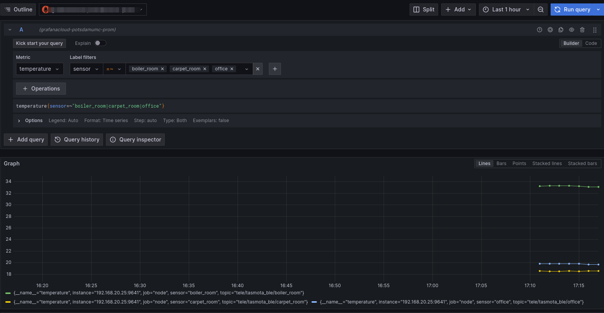

# MQTT-Prometheus-Grafana

Investigate bridging mqtt sensor data to prometheus and plotting with grafana

## Setup Prometheus and Grafana

For quick start, sign up for a free [Grafana Cloud](https://grafana.com/products/cloud/) account.

## Export data from MQTT to Prometheus

There are a number of pre-built mqtt to prometheus solutions:

- https://github.com/kpetremann/mqtt-exporter - recently updated, reasonable documentation (python)
- https://github.com/hikhvar/mqtt2prometheus - somewhat recently updated, one topic per process (go)
- https://github.com/inovex/mqtt_blackbox_exporter - not recently updated, some old issues (go)

I will try [mqtt-exporter](https://github.com/kpetremann/mqtt-exporter) because it explicitely mentions Xiamo sensors, which matches what I'm testing with.

## Test mqtt-exporter using Docker

Try a simple deployment of mqtt-exporter

```shell
$ docker run -it -p 9000:9000 -e "MQTT_ADDRESS=192.168.XX.XX" kpetrem/mqtt-exporter
...
INFO:mqtt-exporter:creating prometheus metric: PromMetricId(name='mqtt_so_117', labels=())
INFO:mqtt-exporter:creating prometheus metric: PromMetricId(name='mqtt_lk', labels=())
INFO:mqtt-exporter:creating prometheus metric: PromMetricId(name='mqtt_lt_st', labels=())
INFO:mqtt-exporter:creating prometheus metric: PromMetricId(name='mqtt_bat', labels=())
INFO:mqtt-exporter:creating prometheus metric: PromMetricId(name='mqtt_dslp', labels=())
INFO:mqtt-exporter:creating prometheus metric: PromMetricId(name='mqtt_ver', labels=())
INFO:mqtt-exporter:creating prometheus metric: PromMetricId(name='mqtt_Temperature', labels=())
INFO:mqtt-exporter:creating prometheus metric: PromMetricId(name='mqtt_Humidity', labels=())
INFO:mqtt-exporter:creating prometheus metric: PromMetricId(name='mqtt_DewPoint', labels=())
INFO:mqtt-exporter:creating prometheus metric: PromMetricId(name='mqtt_Btn', labels=())
INFO:mqtt-exporter:creating prometheus metric: PromMetricId(name='mqtt_Battery', labels=())
INFO:mqtt-exporter:creating prometheus metric: PromMetricId(name='mqtt_RSSI', labels=())
```

Wait 30 seconds for the next update, got this:

```shell
INFO:mqtt-exporter:creating prometheus metric: PromMetricId(name='mqtt_BLEDevices_A4C1386BFDA6_i', labels=())
INFO:mqtt-exporter:creating prometheus metric: PromMetricId(name='mqtt_BLEDevices_A4C1386BFDA6_r', labels=())
INFO:mqtt-exporter:creating prometheus metric: PromMetricId(name='mqtt_BLEDevices_A4C1387C2DCF_i', labels=())
INFO:mqtt-exporter:creating prometheus metric: PromMetricId(name='mqtt_BLEDevices_A4C1387C2DCF_r', labels=())
INFO:mqtt-exporter:creating prometheus metric: PromMetricId(name='mqtt_BLEDevices_A4C138CDF5E5_i', labels=())
INFO:mqtt-exporter:creating prometheus metric: PromMetricId(name='mqtt_BLEDevices_A4C138CDF5E5_r', labels=())
INFO:mqtt-exporter:creating prometheus metric: PromMetricId(name='mqtt_BLEDevices_A4C138C39CDD_i', labels=())
INFO:mqtt-exporter:creating prometheus metric: PromMetricId(name='mqtt_BLEDevices_A4C138C39CDD_r', labels=())
INFO:mqtt-exporter:creating prometheus metric: PromMetricId(name='mqtt_BLEDevices_A4C138025947_i', labels=())
INFO:mqtt-exporter:creating prometheus metric: PromMetricId(name='mqtt_BLEDevices_A4C138025947_r', labels=())
INFO:mqtt-exporter:creating prometheus metric: PromMetricId(name='mqtt_BLEDevices_A4C1385DF832_i', labels=())
INFO:mqtt-exporter:creating prometheus metric: PromMetricId(name='mqtt_BLEDevices_A4C1385DF832_r', labels=())
INFO:mqtt-exporter:creating prometheus metric: PromMetricId(name='mqtt_BLEDevices_0CC8447CEDFA_i', labels=())
INFO:mqtt-exporter:creating prometheus metric: PromMetricId(name='mqtt_BLEDevices_0CC8447CEDFA_r', labels=())
INFO:mqtt-exporter:creating prometheus metric: PromMetricId(name='mqtt_BLEDevices_187A3ECBF8E1_i', labels=())
INFO:mqtt-exporter:creating prometheus metric: PromMetricId(name='mqtt_BLEDevices_187A3ECBF8E1_r', labels=())
```

It appears to be working, but needs some  tuning

run again with narrowed topic:

```shell
$ docker run -it -p 9000:9000 -e "MQTT_ADDRESS=192.168.20.25" -e "MQTT_TOPIC=tele/tasmota_ble/#" kpetrem/mqtt-exporter
INFO:mqtt-exporter:subscribing to "tele/tasmota_ble/#"
INFO:mqtt-exporter:creating prometheus metric: PromMetricId(name='mqtt_Temperature', labels=())
INFO:mqtt-exporter:creating prometheus metric: PromMetricId(name='mqtt_Humidity', labels=())
INFO:mqtt-exporter:creating prometheus metric: PromMetricId(name='mqtt_DewPoint', labels=())
INFO:mqtt-exporter:creating prometheus metric: PromMetricId(name='mqtt_Btn', labels=())
INFO:mqtt-exporter:creating prometheus metric: PromMetricId(name='mqtt_Battery', labels=())
INFO:mqtt-exporter:creating prometheus metric: PromMetricId(name='mqtt_RSSI', labels=())
```

check the exposed values

```shell
$ curl  -o - http://localhost:9000/metrics
...
mqtt_Temperature{topic="tele_tasmota_ble_office"} 19.6
mqtt_Temperature{topic="tele_tasmota_ble_carpet_room"} 18.7
mqtt_Temperature{topic="tele_tasmota_ble_boiler_room"} 33.0
...
```

I think this will work, but it will require label rewriting:

- strip `tele_tasmota_ble_` prefix from topics
- drop `mqtt_Btn` subject

One limitation I see is that mqtt-exporter only supports gauge types. In the future I am going to want to support counter data as well.

## Test mqtt2prometheus using Docker

Try [mqtt2prometheus](https://github.com/hikhvar/mqtt2prometheus) instead because it supports counters and gauges.

Key components of the config.yaml file:

```yaml
# The MQTT broker to connect to
 server: tcp://192.168.XX.XX:1883
 # The Topic path to subscribe to. Be aware that you have to specify the wildcard, if you want to follow topics for multiple sensors.
 topic_path: tele/tasmota_ble/+
 # Optional: Regular expression to extract the device ID from the topic path. The default regular expression, assumes
 # that the last "element" of the topic_path is the device id.
 # The regular expression must contain a named capture group with the name deviceid
 # For example the expression for tasamota based sensors is "tele/(?P<deviceid>.*)/.*"
 device_id_regex: "tele/tasmota_ble/(?P<deviceid>.*)"
 # Optional: Configures mqtt2prometheus to expect an object containing multiple metrics to be published as the value on an mqtt topic.
 # This is the default.
 object_per_topic_config:
  # The encoding of the object, currently only json is supported
  encoding: JSON
cache:
 # Timeout. Each received metric will be presented for this time if no update is send via MQTT.
 # Set the timeout to -1 to disable the deletion of metrics from the cache. The exporter presents the ingest timestamp
 # to prometheus.
 timeout: 5m
json_parsing:
 # Separator. Used to split path to elements when accessing json fields.
 # You can access json fields with dots in it. F.E. {"key.name": {"nested": "value"}}
 # Just set separator to -> and use key.name->nested as mqtt_name
 separator: .
# This is a list of valid metrics. Only metrics listed here will be exported
metrics:
 # The name of the metric in prometheus
 - prom_name: temperature
  # The name of the metric in a MQTT JSON message
   mqtt_name: Temperature
  # The prometheus help text for this metric
   help: temperature in Celcius
  # The prometheus type for this metric. Valid values are: "gauge" and "counter"
   type: gauge
```

Run the program in a docker container, map in the yaml file:

```shell
$ docker run -it --rm -v "$(pwd)/config.yaml:/config.yaml" -p 9641:9641 ghcr.io/hikhvar/mqtt2prometheus:latest
2024-02-18T21:48:43Z    info    mqttclient/mqttClient.go:20     Connected to MQTT Broker
2024-02-18T21:48:43Z    info    mqttclient/mqttClient.go:21     Will subscribe to topic {"topic": "tele/tasmota_ble/+"}
2024-02-18T21:48:43Z    info    web/tls_config.go:195           {"level": "info", "msg": "TLS is disabled.", "http2": false}
```

Check the metrics

```shell
$ curl  -o - http://localhost:9641/metrics
...
# TYPE temperature gauge
temperature{sensor="boiler_room",topic="tele/tasmota_ble/boiler_room"} 32.6 1708292967946
temperature{sensor="carpet_room",topic="tele/tasmota_ble/carpet_room"} 18.6 1708292996841
temperature{sensor="office",topic="tele/tasmota_ble/office"} 19.2 1708292995906
```

Looks good, I think I will stick with mqtt2prometheus

## Export Metrics using Grafana Agent

Install [Grafana Agent](https://grafana.com/oss/agent/) and configure it to send metrics to Grafana Cloud.

I do not expect to send metrics from the host system to Grafana cloud, therefore I think its reasonable to run Grafana Agent in docker.

### Create an API Token and Agent.yaml file in Grafana Cloud

Create a new token for the agent to use. Go to Connections / Add New Connection. Choose `Hosted Prometheus metrics` and click `Create new config`

Enter an access policy token name, then click Create. A sample agent.yaml file will be generated:

```yaml
metrics:
  global:
    scrape_interval: 60s
  configs:
  - name: hosted-prometheus
    scrape_configs:
      - job_name: node
        static_configs:
        - targets: ['192.168.XX.XX:9641']
    remote_write:
      - url: https://prometheus-prod-01-prod-us-east-0.grafana.net/api/prom/push
        basic_auth:
          username: somename
          password: some-password
```

### Run Grafana Agent in a Docker container

create a folder to hold WAL data, map that folder and the agent.yaml file into the docker container:

```shell
$ docker run -it -v "$(pwd)/wal_data:/etc/agent/data" -v "$(pwd)/agent.yaml:/etc/agent/agent.yaml" grafana/agent:main-e7b95cf
ts=2024-02-18T22:10:26.094205169Z caller=main.go:75 level=info boringcryptoenabled=false
ts=2024-02-18T22:10:26.094513637Z caller=server.go:190 level=info msg="server listening on addresses" http=127.0.0.1:12345 grpc=127.0.0.1:12346 http_tls_enabled=false grpc_tls_enabled=false
ts=2024-02-18T22:10:26.095300694Z caller=node.go:85 level=info agent=prometheus component=cluster msg="applying config"
ts=2024-02-18T22:10:26.095711047Z caller=remote.go:180 level=info agent=prometheus component=cluster msg="not watching the KV, none set"
ts=2024-02-18T22:10:26.097992462Z caller=zapadapter.go:78 level=info component=traces msg="Traces Logger Initialized"
ts=2024-02-18T22:10:26.102713319Z caller=reporter.go:38 level=info msg="running usage stats reporter"
ts=2024-02-18T22:10:26.116923723Z caller=wal.go:211 level=info agent=prometheus instance=3d2cc5e4f0cf4b766f782813d2c0b4cf msg="replaying WAL, this may take a while" dir=/etc/agent/data/3d2cc5e4f0cf4b766f782813d2c0b4cf/wal
ts=2024-02-18T22:10:26.117383298Z caller=wal.go:260 level=info agent=prometheus instance=3d2cc5e4f0cf4b766f782813d2c0b4cf msg="WAL segment loaded" segment=0 maxSegment=0
ts=2024-02-18T22:10:26.118728883Z caller=dedupe.go:112 agent=prometheus instance=3d2cc5e4f0cf4b766f782813d2c0b4cf component=remote level=info remote_name=3d2cc5-897740 url=https://prometheus-prod-13-prod-us-east-0.grafana.net/api/prom/push msg="Starting WAL watcher" queue=3d2cc5-897740
ts=2024-02-18T22:10:26.118763603Z caller=dedupe.go:112 agent=prometheus instance=3d2cc5e4f0cf4b766f782813d2c0b4cf component=remote level=info remote_name=3d2cc5-897740 url=https://prometheus-prod-13-prod-us-east-0.grafana.net/api/prom/push msg="Starting scraped metadata watcher"
ts=2024-02-18T22:10:26.119416098Z caller=dedupe.go:112 agent=prometheus instance=3d2cc5e4f0cf4b766f782813d2c0b4cf component=remote level=info remote_name=3d2cc5-897740 url=https://prometheus-prod-13-prod-us-east-0.grafana.net/api/prom/push msg="Replaying WAL" queue=3d2cc5-897740
```

### Explore Grafana Cloud Metrics

Navigate the Explore menu option in Grafana cloud, select the Prometheus data source, select a metric and sensors to view:



