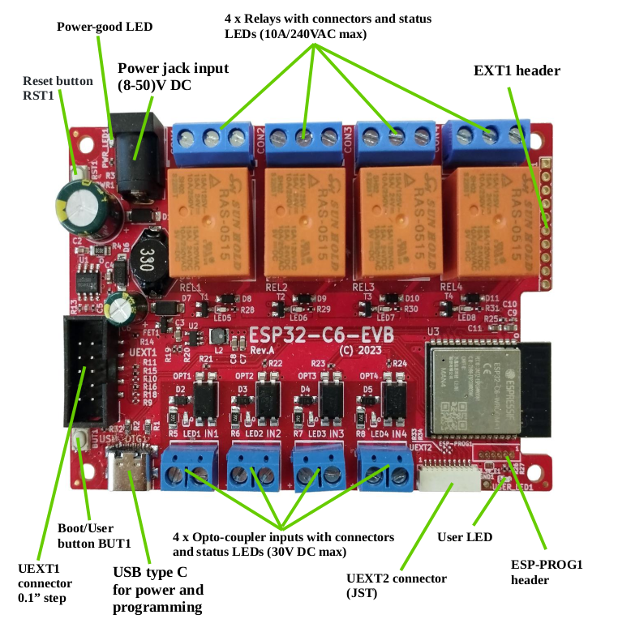
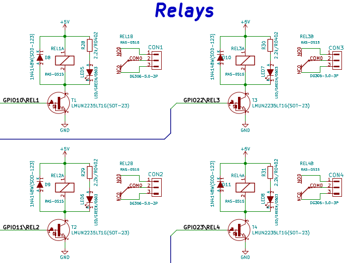
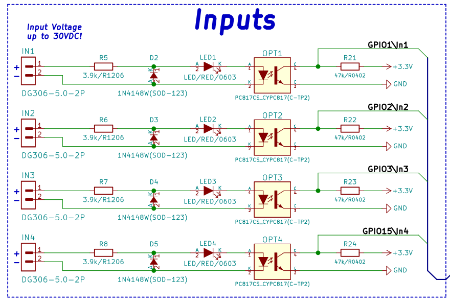
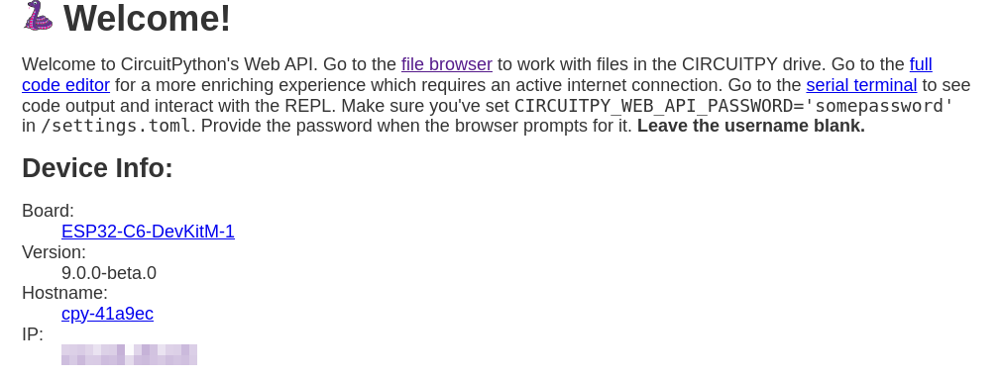
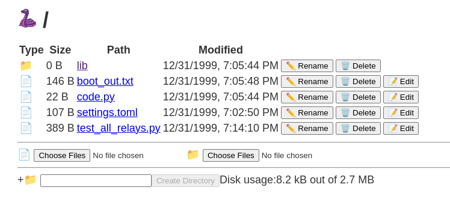

# olimex-esp32-c6-evb-circuitpython-relay

Evaluate the Olimex ESP32-C6-EVB board using CircuitPython

- [x] Determine how to activate each relay
- [x] Determine how to read the status of each optocoupler


# Components

- [Olimex ESP32-C6-EVB](https://www.olimex.com/Products/IoT/ESP32-C6/ESP32-C6-EVB/open-source-hardware)
- [CircuitPython for ESP32-C6](https://circuitpython.org/board/espressif_esp32c6_devkitm_1_n4/)

## Olimex ESP32-C6-EVB

The Olimex board provides 4 relays and 4 optocoupler inputs, USB-C power and communication,  optional DC 8-50VDC power input, user and reset button and an Espressif ESP32-C6




## Installing CircuitPython

The Olimex board has an ESP32-C6-N4 SOC chip (4 MB of flash)

1. Download CircuitPython image`adafruit-circuitpython-espressif_esp32c6_devkitm_1_n4-en_US-9.0.0-beta.0.bin` 

2. Connect the board to USB port

3. View the dmesg log to identify the USB port as `/dev/ttyACM0`
   ```shell
   usb 1-7.4.1: USB disconnect, device number 103
   usb 1-7.4.1: new full-speed USB device number 104 using xhci_hcd
   usb 1-7.4.1: New USB device found, idVendor=303a, idProduct=1001, bcdDevice= 1.02
   usb 1-7.4.1: New USB device strings: Mfr=1, Product=2, SerialNumber=3
   usb 1-7.4.1: Product: USB JTAG/serial debug unit
   usb 1-7.4.1: Manufacturer: Espressif
   usb 1-7.4.1: SerialNumber: 40:4C:CA:41:A9:EC
   cdc_acm 1-7.4.1:1.0: ttyACM0: USB ACM device
   ```

4. Use `esptool` to connect to the board and verify its chip_id and flash_id
   ```shell
   ❯ esptool.py --chip auto --port /dev/ttyACM0 chip_id
   esptool.py v4.7.0
   Serial port /dev/ttyACM0
   Connecting....
   Detecting chip type... ESP32-C6
   Chip is ESP32-C6 (QFN40) (revision v0.0)
   Features: WiFi 6, BT 5, IEEE802.15.4
   Crystal is 40MHz
   MAC: 40:4c:ca:ff:fe:41:a9:ec
   BASE MAC: 40:4c:ca:41:a9:ec
   MAC_EXT: ff:fe
   Uploading stub...
   Running stub...
   Stub running...
   Warning: ESP32-C6 has no Chip ID. Reading MAC instead.
   MAC: 40:4c:ca:ff:fe:41:a9:ec
   BASE MAC: 40:4c:ca:41:a9:ec
   MAC_EXT: ff:fe
   Hard resetting via RTS pin...
   
   ❯ esptool.py --chip auto --port /dev/ttyACM0 flash_id
   esptool.py v4.7.0
   Serial port /dev/ttyACM0
   Connecting...
   Detecting chip type... ESP32-C6
   Chip is ESP32-C6 (QFN40) (revision v0.0)
   Features: WiFi 6, BT 5, IEEE802.15.4
   Crystal is 40MHz
   MAC: 40:4c:ca:ff:fe:41:a9:ec
   BASE MAC: 40:4c:ca:41:a9:ec
   MAC_EXT: ff:fe
   Uploading stub...
   Running stub...
   Stub running...
   Manufacturer: c8
   Device: 4016
   Detected flash size: 4MB
   Hard resetting via RTS pin...
   ```

5. Erase the flash
   ```shell
   ❯ esptool.py --chip auto --port /dev/ttyACM0 erase_flash
   esptool.py v4.7.0
   Serial port /dev/ttyACM0
   Connecting...
   Detecting chip type... ESP32-C6
   Chip is ESP32-C6 (QFN40) (revision v0.0)
   Features: WiFi 6, BT 5, IEEE802.15.4
   Crystal is 40MHz
   MAC: 40:4c:ca:ff:fe:41:a9:ec
   BASE MAC: 40:4c:ca:41:a9:ec
   MAC_EXT: ff:fe
   Uploading stub...
   Running stub...
   Stub running...
   Erasing flash (this may take a while)...
   Chip erase completed successfully in 0.7s
   Hard resetting via RTS pin...
   ```

6. upload the CircuitPython image
   ```shell
   ❯ esptool.py --chip auto --port /dev/ttyACM0 write_flash 0x0 /tmp/adafruit-circuitpython-espressif_esp32c6_devkitm_1_n4-en_US-9.0.0-beta.0.bin 
   esptool.py v4.7.0
   Serial port /dev/ttyACM0
   Connecting...
   Detecting chip type... ESP32-C6
   Chip is ESP32-C6 (QFN40) (revision v0.0)
   Features: WiFi 6, BT 5, IEEE802.15.4
   Crystal is 40MHz
   MAC: 40:4c:ca:ff:fe:41:a9:ec
   BASE MAC: 40:4c:ca:41:a9:ec
   MAC_EXT: ff:fe
   Uploading stub...
   Running stub...
   Stub running...
   Configuring flash size...
   Flash will be erased from 0x00000000 to 0x00163fff...
   Compressed 1458000 bytes to 898237...
   Wrote 1458000 bytes (898237 compressed) at 0x00000000 in 4.7 seconds (effective 2456.3 kbit/s)...
   Hash of data verified.
   
   Leaving...
   Hard resetting via RTS pin...
   ```

7. Connect to the board via USB to test the repl
   ```python
   ---- Opened the serial port /dev/ttyACM0 ----
   Auto-reload is on. Simply save files over USB to run them or enter REPL to disable.
   
   Press any key to enter the REPL. Use CTRL-D to reload.
   ---- Sent hex encoded message: "03" ----
   Wi-Fi: off | REPL | 9.0.0-beta.0
   Adafruit CircuitPython 9.0.0-beta.0 on 2024-01-27; ESP32-C6-DevKitM-1 with ESP32-C6N4
   ```

## Relays

The Olimex board provides 4 relays on ports GPIO10, 11, 22 and 23




### Turn on a relay using CircuitPython

Try turning on relay 1, which is on IO port 10

```python
>>> import board
>>> import digitalio
>>> relay_1 = digitalio.DigitalInOut(board.IO10)
>>> relay_1.direction = digitalio.Direction.OUTPUT
>>> relay_1.value = True  # relay turns on
>>> relay_1.value = False # relay turns off
```

### Cycle through all relays

Try turning all the relays on and off one at a time:

```python
>>> import time
>>> for port in (board.IO10, board.IO11, board.IO22, board.IO23):
...     relay = digitalio.DigitalInOut(port)
...     relay.direction = digitalio.Direction.OUTPUT
...     relay.value = True
...     time.sleep(1)
...     relay.value = False
...     
...     
... 
Traceback (most recent call last):
  File "<stdin>", line 1, in <module>
AttributeError: 'module' object has no attribute 'IO11'
```

Bummer, it appears that some IO port numbers are not supported, or are mapped to a different name:

```python
>>> board.IO
IO0             IO1             IO10            IO18
IO19            IO2             IO20            IO21
IO3             IO4             IO5             IO6
IO7             IO8             IO9
```

Missing:

- IO11
- IO22
- IO23

Try using `microcontroller.pins` instead:

```python
>>> relays = (microcontroller.pin.GPIO10, microcontroller.pin.GPIO11, microcontroller.pin.GPIO22, microcontroller.pin.GPIO23)
>>> for relay_port in relays:
...     relay = digitalio.DigitalInOut(relay_port)
...     relay.direction = digitalio.Direction.OUTPUT
...     relay.value = True
...     time.sleep(1)
...     relay.value = False
...     
...     
... 
Traceback (most recent call last):
  File "<stdin>", line 2, in <module>
ValueError: IO10 in use
>>> 
```

Well that's a start . Reset the board and try again, still fails

Try again using context manager:

```python
# activate each relay for 1 second
import digitalio
import time
import microcontroller

port_numbers = (
    microcontroller.pin.GPIO10,
    microcontroller.pin.GPIO11,
    microcontroller.pin.GPIO22,
    microcontroller.pin.GPIO23,
)
for relay_port in port_numbers:
    with digitalio.DigitalInOut(relay_port) as relay:
        relay.direction = digitalio.Direction.OUTPUT
        relay.value = True
        time.sleep(1)
        relay.value = False
```

This approach worked and the relays were activated as expected.

## Optocoupler Inputs

The Olimex board supports four optocouplers driving GPIO inputs



### Read optocoupler input

GPIO ports 1, 2, 3 and 15 will read True (high) when the optocoupler input is not active, and False (low) when the input is driven by 3 to 30VDC

Try the following script that polls each input and reports when one input at a time is "active".

```python
# read each input and report when true
import digitalio
import time
import microcontroller

port_numbers = (
    microcontroller.pin.GPIO1,
    microcontroller.pin.GPIO2,
    microcontroller.pin.GPIO3,
    microcontroller.pin.GPIO15,
)

port_name_items = [
    (digitalio.DigitalInOut(port_number), port_number) for port_number in port_numbers
]

for port, port_name in port_name_items:
    port.direction = digitalio.Direction.INPUT

print("Polling inputs")
while True:
    for port, port_name in port_name_items:
        if not port.value:
            print(f"{port_name} is True")
            while not port.value:
                time.sleep(0.1)
            print(f"{port_name} is False")

    time.sleep(0.1)
```

Run the  `test_inputs` script and 5 VDC to each input one at a time:

```shell
❯ ampy run test_inputs.py
Polling inputs
board.IO1 is True
board.IO1 is False
board.IO2 is True
board.IO2 is False
board.IO3 is True
board.IO3 is False
microcontroller.pin.GPIO15 is True
microcontroller.pin.GPIO15 is False
^C
Aborted!
```


## Uploading code to onboard file system

The ESP32-C6 does not support USB drive emulation. Therefore code cannot be uploaded using the CIRCUITPY USB drive feature that is found on other boards.

### Ampy

As an alternative, the [ampy](https://github.com/scientifichackers/ampy) Python script can be used to upload code over the USB/TTY connection

```shell
❯ pipx install adafruit-ampy
  installed package adafruit-ampy 1.1.0, installed using Python 3.10.12                                                                                                                       
  These apps are now globally available
    - ampy
done! ✨ 🌟 ✨

```

Verify it can access the board's flash file system:

```shell
❯ ampy -p /dev/ttyACM0 ls                                                                      
/boot_out.txt
/code.py     
/lib          
/settings.toml
```

Run the test script

```shell
❯ ampy -p /dev/ttyACM0 run test_all_relays.py
```

Upload the test script

```shell
❯ ampy -p /dev/ttyACM0 put test_all_relays.py
```

**Note** To enable the `ampy get` command, I had to change `files.py` in the Ampy package to send `binascii` to the remote device, instead of `ubinascii`

### Web API File Browser

The `settings.toml` file on the board's flash file system can be configured with a WiFi SSID, password and API password, e.g.

```shell
❯ ampy get settings.toml
CIRCUITPY_WIFI_SSID = "mywifi-access-point"
CIRCUITPY_WIFI_PASSWORD = "its-a-secret"
CIRCUITPY_WEB_API_PASSWORD = "use-this-password"
```

After restarting, the board will login to the WiFI access point and acquire an IP address. That address will be displayed in the Python REPL over the USB connection. Connect to the IP address via a web browser to gain access to the Web API:



The file browser UI provides a simple means to upload and download files:



## Checking out Bluetooth BLE

The ESP32-C6 SOC supports BLE. However that module is not currently supported in the version of CircuitPython I used.

```python
Adafruit CircuitPython 9.0.0-beta.0 on 2024-01-27; ESP32-C6-DevKitM-1 with ESP32-C6N4
>>> import _ble
Traceback (most recent call last):
  File "<stdin>", line 1, in <module>
ImportError: no module named '_ble'
>>> 
```

