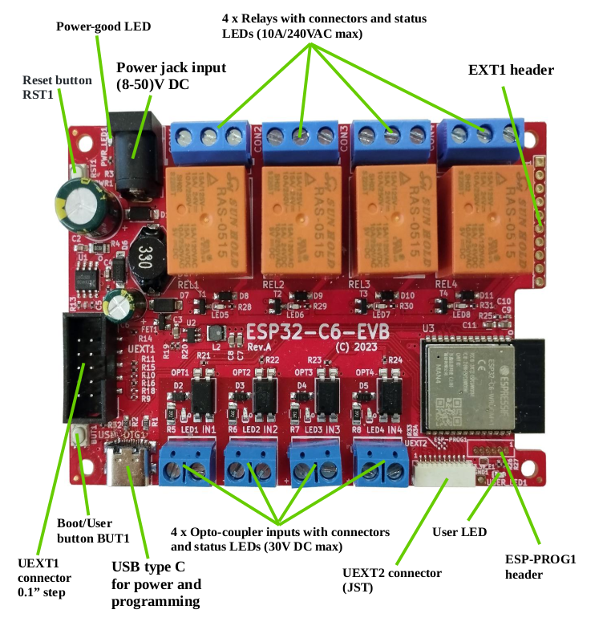
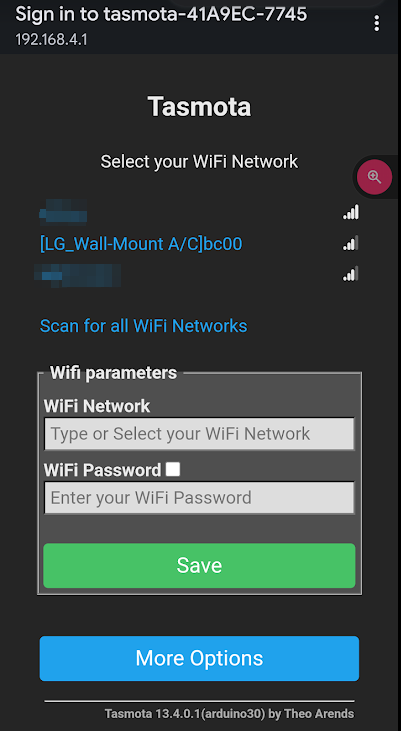
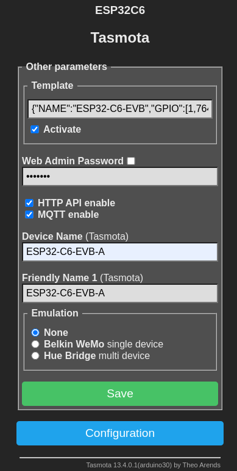
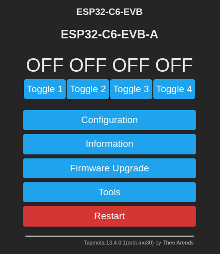
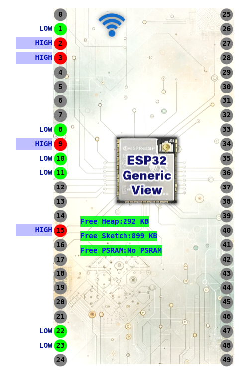
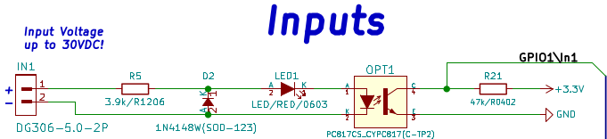

# olimex-esp32-c6-evb-tasmota-relay

Evaluate the Olimex ESP32-C6-EVB board using CircuitPython

Investigate how to:

- [x] activate each relay
- [x] read the current status of each optocoupler
- [x] count pulses on an optocoupler input
- [ ] limit relay on time
- [ ] report total time an optocoupler input has been active


## Components

- [Olimex ESP32-C6-EVB](https://www.olimex.com/Products/IoT/ESP32-C6/ESP32-C6-EVB/open-source-hardware)
- [Tasmota compiled for ESP32-C6](https://templates.blakadder.com/ESP32-C6-EVB.html)


### Olimex ESP32-C6-EVB

The Olimex board provides 4 relays and 4 optocoupler inputs, USB-C power and communication,  optional DC 8-50VDC power input, user and reset button and an Espressif ESP32-C6




### Installing Tasmota

The Olimex board has an ESP32-C6-N4 SOC chip (4 MB of flash)

1. Download `tasmota32c6cdc-arduino30.factory.bin` from the [Tasmota Unofficial Builds](https://github.com/tasmota/install/blob/firmware/firmware/development/tasmota32c6cdc-arduino30.factory.bin) repository

2. Connect the board to the USB port

3. View the dmesg log to identify the USB port as `/dev/ttyACM0`
   ```shell
   usb 1-7.4.1: USB disconnect, device number 103
   usb 1-7.4.1: new full-speed USB device number 104 using xhci_hcd
   usb 1-7.4.1: New USB device found, idVendor=303a, idProduct=1001, bcdDevice= 1.02
   usb 1-7.4.1: New USB device strings: Mfr=1, Product=2, SerialNumber=3
   usb 1-7.4.1: Product: USB JTAG/serial debug unit
   usb 1-7.4.1: Manufacturer: Espressif
   usb 1-7.4.1: SerialNumber: 40:4C:CA:41:A9:EC
   cdc_acm 1-7.4.1:1.0: ttyACM0: USB ACM device
   ```

4. Use `esptool` to connect to the board and verify its chip_id and flash_id
   ```shell
   ❯ esptool.py --chip auto --port /dev/ttyACM0 chip_id
   esptool.py v4.7.0
   Serial port /dev/ttyACM0
   Connecting....
   Detecting chip type... ESP32-C6
   Chip is ESP32-C6 (QFN40) (revision v0.0)
   Features: WiFi 6, BT 5, IEEE802.15.4
   Crystal is 40MHz
   MAC: 40:4c:ca:ff:fe:41:a9:ec
   BASE MAC: 40:4c:ca:41:a9:ec
   MAC_EXT: ff:fe
   Uploading stub...
   Running stub...
   Stub running...
   Warning: ESP32-C6 has no Chip ID. Reading MAC instead.
   MAC: 40:4c:ca:ff:fe:41:a9:ec
   BASE MAC: 40:4c:ca:41:a9:ec
   MAC_EXT: ff:fe
   Hard resetting via RTS pin...
   
   ❯ esptool.py --chip auto --port /dev/ttyACM0 flash_id
   esptool.py v4.7.0
   Serial port /dev/ttyACM0
   Connecting...
   Detecting chip type... ESP32-C6
   Chip is ESP32-C6 (QFN40) (revision v0.0)
   Features: WiFi 6, BT 5, IEEE802.15.4
   Crystal is 40MHz
   MAC: 40:4c:ca:ff:fe:41:a9:ec
   BASE MAC: 40:4c:ca:41:a9:ec
   MAC_EXT: ff:fe
   Uploading stub...
   Running stub...
   Stub running...
   Manufacturer: c8
   Device: 4016
   Detected flash size: 4MB
   Hard resetting via RTS pin...
   ```

5. Erase the flash
   ```shell
   ❯ esptool.py --chip auto --port /dev/ttyACM0 erase_flash
   esptool.py v4.7.0
   Serial port /dev/ttyACM0
   Connecting...
   Detecting chip type... ESP32-C6
   Chip is ESP32-C6 (QFN40) (revision v0.0)
   Features: WiFi 6, BT 5, IEEE802.15.4
   Crystal is 40MHz
   MAC: 40:4c:ca:ff:fe:41:a9:ec
   BASE MAC: 40:4c:ca:41:a9:ec
   MAC_EXT: ff:fe
   Uploading stub...
   Running stub...
   Stub running...
   Erasing flash (this may take a while)...
   Chip erase completed successfully in 0.7s
   Hard resetting via RTS pin...
   ```

6. Upload the tasmota image
   ```shell
   ❯ esptool.py --chip auto --port /dev/ttyACM0 write_flash 0x0 ~/Downloads/tasmota32c6cdc-arduino30.factory.bin 
   esptool.py v4.7.0                        
   Serial port /dev/ttyACM0
   Connecting...                                                                                  
   Detecting chip type... ESP32-C6                                                                
   Chip is ESP32-C6 (QFN40) (revision v0.0) 
   Features: WiFi 6, BT 5, IEEE802.15.4 
   Crystal is 40MHz                               
   MAC: 40:4c:ca:ff:fe:41:a9:ec             
   BASE MAC: 40:4c:ca:41:a9:ec               
   MAC_EXT: ff:fe                             
   Uploading stub...                              
   Running stub...                                                                                
   Stub running...         
   Configuring flash size...                                                                      
   Flash will be erased from 0x00000000 to 0x002cffff...
   Compressed 2945856 bytes to 1761494...                                                         
   Wrote 2945856 bytes (1761494 compressed) at 0x00000000 in 9.6 seconds (effective 2451.0 kbit/s)...
   Hash of data verified.                                                                                                                                                                        
   
   Leaving...
   Hard resetting via RTS pin...
   ```

## Tasmota WiFi Setup

On startup, Tasmota will appear as a WiFi access point. 

1. Connect to the access point to provide the SSID and password of the local WiFi access point to which the device should connect.
2. Select the desired SSID from the list, or enter it in the WiFi Network input box
3. Enter the password




4. The device will reboot and connect to the WiFi network.
5. The device will use DHCP to acquire an IP address from the WiFi network. The IP address is displayed on the USB (tty) console output, as well as on the web interface of the device you used to enter the SSID and password

```shell
00:00:59.565 APP: Restarting
ESP-ROM:esp32c6-20220919
Build:Sep 19 2022
rst:0xc (SW_CPU),boot:0x7f (SPI_FAST_FLASH_BOOT)
Saved PC:0x4001975a
SPIWP:0xee
mode:DIO, clock div:2
load:0x4086c410,len:0xb68
load:0x4086e610,len:0x2214
load:0x40875728,len:0xf8
SHA-256 comparison failed:
Calculated: f4e5268c443be051003925fecff3e1d76946eb6590a9b23d7904e73e38e339a5
Expected: ffffffffffffffffffffffffffffffffffffffffffffffffffffffffffffffff
Attempting to boot anyway...
entry 0x4086c410

00:00:00.002 CMD: Using USB CDC
00:00:00.002 HDW: ESP32-C6 v0.0 
00:00:00.015 UFS: FlashFS mounted with 308 kB free
00:00:00.028 CFG: Loaded from File, Count 5
00:00:00.029 SER: Set to 8N1 115200 bit/s
00:00:00.030 SER: HWCDC supports 115200 bit/s only
00:00:00.034 QPC: Count 1
00:00:00.071 BRY: Berry initialized, RAM used 4926 bytes
00:00:00.080 Project tasmota - Tasmota Version 13.4.0.1(arduino30)-3_0_0(2024-02-18T17:05:15)
00:00:01.001 WIF: Connecting to AP1 XXXXXXX in mode 11n as tasmota-41A9EC-7745...
00:00:03.216 WIF: Connected
00:00:03.519 HTP: Web server active on tasmota-41A9EC-7745 with IP address 192.168.XX.XX
03:20:36.363 RSL: INFO1 = {"Info1":{"Module":"ESP32C6","Version":"13.4.0.1(arduino30)","FallbackTopic":"cmnd/DVES_41A9EC_fb/","GroupTopic":"cmnd/tasmotas/"}}
03:20:36.365 RSL: INFO2 = {"Info2":{"WebServerMode":"Admin","Hostname":"tasmota-41A9EC-7745","IPAddress":"192.168.XX.XX","IP6Global":"","IP6Local":"fe80::424c:caff:fe41:a9ec%st1"}}
03:20:36.366 RSL: INFO3 = {"Info3":{"RestartReason":"Software reset CPU","BootCount":2}}
03:20:38.911 QPC: Reset
03:20:40.917 RSL: STATE = {"Time":"2024-02-22T03:20:40","Uptime":"0T00:00:09","UptimeSec":9,"Heap":304,"SleepMode":"Dynamic","Sleep":50,"LoadAvg":19,"MqttCount":0,"Berry":{"HeapUsed":4,"Objects":44},"Wifi":{"AP":1,"SSId":"XXXXX","BSSId":"68:D7:9A:CA:6A:2D","Channel":1,"Mode":"11n","RSSI":100,"Signal":-35,"LinkCount":1,"Downtime":"0T00:00:04"}}
```

## Initial Tasmota Configuration

The [Tasmota ESP32-C6-EVB](https://templates.blakadder.com/ESP32-C6-EVB.html) page provides an initial configuration template that can be applied to the `Configure Template` page

```json
{"NAME":"ESP32-C6-EVB","GPIO":[1,7648,7649,7650,1,1,1,1,288,32,224,225,1,1,1,7651,1,1,1,1,1,1,226,227,0,0,0,0,0,0,0],"FLAG":0,"BASE":1}
```

Navigate to `Configuration` / `Configure Other`  and enter the template and populate the other values as desired.




After updating the template the device will restart. The home page now shows `Toggle` buttons for each of the relays



Clicking on a `Toggle` button turns the corresponding relay on and off.

The optocoupler inputs can be checked via `Tools` / `GPIO Viewer`.



In the above image, optocoupler input 1 (GPIO 1) has been activated. The other inputs (GPIO 2, 3, and 15) are not active. These inputs are Active Low.

## Reporting OptoCoupler Inputs

I want the current status of the OptoCoupler inputs to be reported over MQTT when:

- the input changes state
- periodically

Additionally some of the inputs should increment a counter so that its possible to track how long an input has been activated during a given period of time.

### Using Switch Component Type

Rather than using `INPUT` type, try changing the optocouplers to `SWITCH` or `SWITCH_N` component type

The optocoupler inputs are already wired to a pull-up resister




Therefore the component type probably should be `SWITCH_N` (non-pull-up).

Additionally, the relays should not change state when the inputs change state. There are two different ways to do this:

- issue `SetOption114 1`  to decouple all switches from relays
- issue `SwitchMode<x> 15` to decouple the selected switch from any relays


The following Tasmota configuration commands:

```shell
SwitchMode1 16
SwitchText1 input_1
StateText1 0
StateText2 1
```

Causes the following MQTT messages to be sent when the optocoupler is activated, then de-activated:

```json
23:07:38.197 MQT: tele/tasmota_41A9EC/SENSOR = {"Time":"2024-02-22T23:07:38","input_1":"0"}
23:07:44.468 MQT: tele/tasmota_41A9EC/SENSOR = {"Time":"2024-02-22T23:07:44","input_1":"1"}
```

### Using Counter Component Type

Tasmota also supports  `Counter_n`  and `Counter` component types, lets see how that works

Temporarily reconfigure Optocoupler input \#2 as type `Counter` number 1

```shell
CounterType1 0
CounterDebounce 100
```

Activate the input several times to observer counter behaviour

```shell
18:14:28.566 MQT: tele/tasmota_41A9EC/SENSOR = {"Time":"2024-02-24T18:14:28","input_1":"1","COUNTER":{"C1":0}}
18:14:38.608 MQT: tele/tasmota_41A9EC/SENSOR = {"Time":"2024-02-24T18:14:38","input_1":"1","COUNTER":{"C1":6}}
```

The counter can be remotely reset via MQTT message

```
cmnd/tasmota_41A9EC/counter1 => 0
```

## Limiting Relay on Time

I want the relays to automatically turn off  on their own if an MQTT "on" command has not been received within a given time period.

The `PulseTime` option can be used for this, e.g automatically turn off the relay after 5 seconds:

```shell
PulseTime1 105
```

Try sending an MQTT command `cmnd/tasmota_41A9EC/power1` = `1`

The relay turns on, then off after about 8 seconds

```shell
18:50:41.636 MQT: stat/tasmota_41A9EC/RESULT = {"POWER1":"1"}
18:50:41.638 MQT: stat/tasmota_41A9EC/POWER1 = 1
18:50:52.207 MQT: stat/tasmota_41A9EC/RESULT = {"POWER1":"0"}
```

Test to ensure the pulsetime resets every time the command is set, by sending the `power1` command every  4 to 5 seconds

```shell
18:52:44.755 MQT: stat/tasmota_41A9EC/RESULT = {"POWER1":"1"}
18:52:44.756 MQT: stat/tasmota_41A9EC/POWER1 = 1
18:52:49.416 MQT: stat/tasmota_41A9EC/RESULT = {"POWER1":"1"}
18:52:49.418 MQT: stat/tasmota_41A9EC/POWER1 = 1
18:52:53.677 MQT: stat/tasmota_41A9EC/RESULT = {"POWER1":"1"}
18:52:53.679 MQT: stat/tasmota_41A9EC/POWER1 = 1
18:52:57.638 MQT: stat/tasmota_41A9EC/RESULT = {"POWER1":"1"}
18:52:57.639 MQT: stat/tasmota_41A9EC/POWER1 = 1
18:53:02.248 MQT: stat/tasmota_41A9EC/RESULT = {"POWER1":"1"}
18:53:02.251 MQT: stat/tasmota_41A9EC/POWER1 = 1
18:53:06.866 MQT: stat/tasmota_41A9EC/RESULT = {"POWER1":"1"}
18:53:06.868 MQT: stat/tasmota_41A9EC/POWER1 = 1
18:53:10.826 MQT: stat/tasmota_41A9EC/RESULT = {"POWER1":"1"}
18:53:10.829 MQT: stat/tasmota_41A9EC/POWER1 = 1
18:53:14.536 MQT: stat/tasmota_41A9EC/RESULT = {"POWER1":"1"}
18:53:14.539 MQT: stat/tasmota_41A9EC/POWER1 = 1
18:53:19.747 MQT: stat/tasmota_41A9EC/RESULT = {"POWER1":"1"}
18:53:19.750 MQT: stat/tasmota_41A9EC/POWER1 = 1
18:53:24.665 MQT: stat/tasmota_41A9EC/RESULT = {"POWER1":"1"}
18:53:24.667 MQT: stat/tasmota_41A9EC/POWER1 = 1
18:53:28.691 MQT: stat/tasmota_41A9EC/RESULT = {"POWER1":"1"}
18:53:28.694 MQT: stat/tasmota_41A9EC/POWER1 = 1
18:53:39.207 MQT: stat/tasmota_41A9EC/RESULT = {"POWER1":"0"}
18:53:39.210 MQT: stat/tasmota_41A9EC/POWER1 = 0
```

It works as expected


## Tasmota Configuration Summary

These initial setup options were used:

- SetOption114 1 - Detach switches from relays and send MQTT messages instead
- TelePeriod 10 - send MQTT status updates every 10 seconds instead of once every 300 seconds
- LedState 7 - show power state and MQTT messages as a LED blink
- SwitchMode1 16 - inverted send only an MQTT message on switch change
- StateText1 0 - when off, send "0" instead of "OFF"
- StateText2 1 - when on, send "1" instead on "ON"


